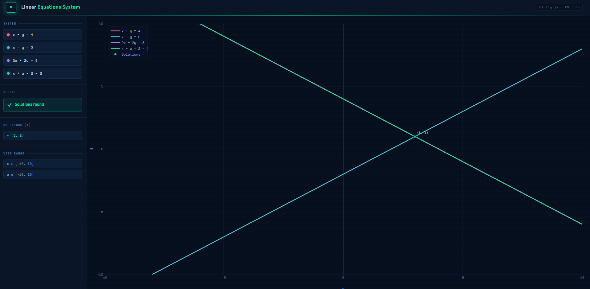

# Linear Equations Solver

A Go command-line tool that parses linear equations, computes intersection points, and exports an interactive Plotly.js HTML visualization.



## Running

The project consists of multiple Go files. To run, use one of the following commands in the project directory:

### Basic run commands

```bash
# Run the entire package (recommended)
go run .

# Run all .go files
go run *.go
```

### Examples with parameters

```bash
# Use built-in example (if no equations specified)
go run . -o tmp/output.html

# Solve specific system of equations
go run . -i "x + y = 4" -i "x - y = 2" -o tmp/my_equations.html

# With multiple equations and axis bounds
go run . -i "2x + 3y = 6" -i "x - y = 1" -i "x + 2y = 4" -o tmp/complex.html -xmin -5 -xmax 5 -ymin -5 -ymax 5

# Incompatible system (no solutions)
go run . -i "x + y = 1" -i "x + y = 2" -o tmp/no_solution.html
```

### Command-line parameters

- `-i "equation"`: Equation in format "ax + by = c" (parameter can be repeated for multiple equations)
- `-o filename.html`: Output HTML file name (default: tmp/equations.html)
- `-xmin float`: Lower bound of X axis (default: -10)
- `-xmax float`: Upper bound of X axis (default: 10)
- `-ymin float`: Lower bound of Y axis (default: -10)
- `-ymax float`: Upper bound of Y axis (default: 10)

### Built-in example

If no equations are specified with `-i`, the built-in example is used:
- x + y = 4
- x - y = 2
- 2x + 2y = 8
- x + y - 2 = 2

## Output

The program outputs:
- Parsed equations with A, B, C coefficients
- Found solutions (intersection points)
- Saves interactive chart to HTML file in `tmp/` directory

Example output:
```
Equations not specified — using built-in example.

  Parsing equations:
  x + y = 4                       →  A=1      B=1      C=4
  x - y = 2                       →  A=1      B=-1     C=2

  Found 1 solutions:
      (3, 1)

  → Saved: tmp/equations.html
```

## Contact
```
Telegram: @gof4rvr
Email: r3ndyhell@gmail.com
```